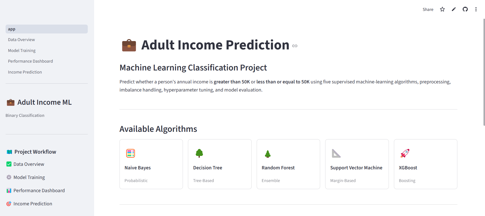
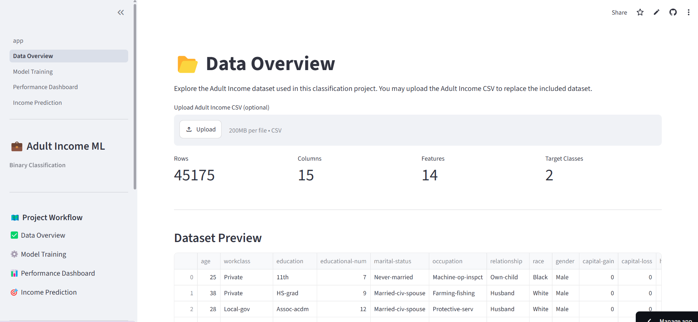
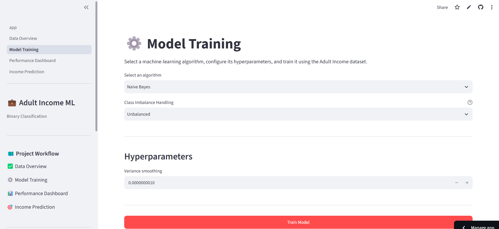
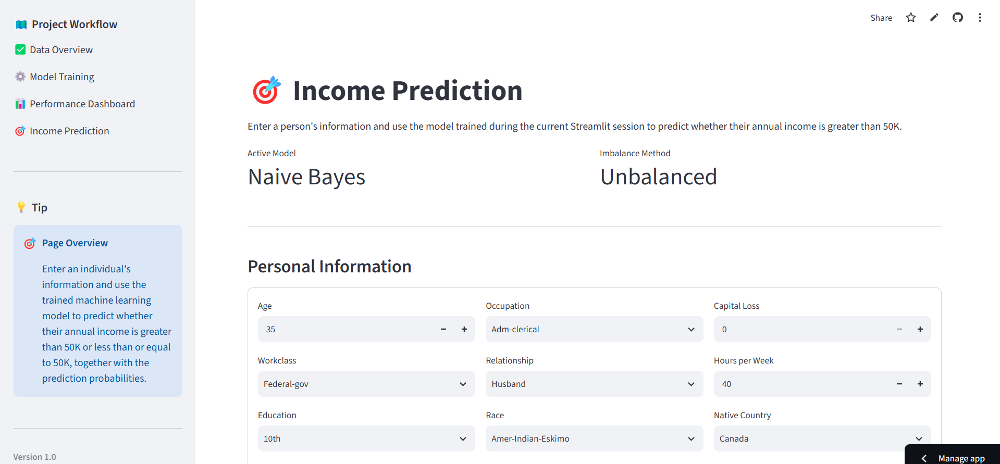
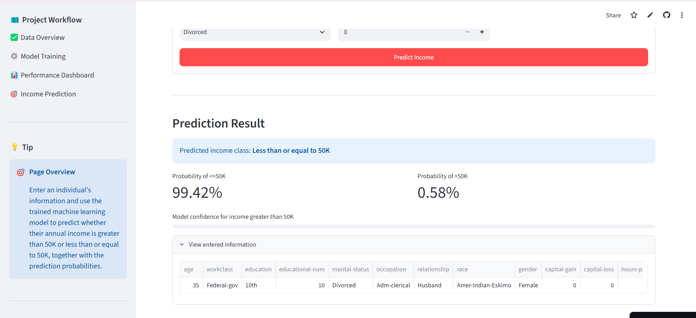
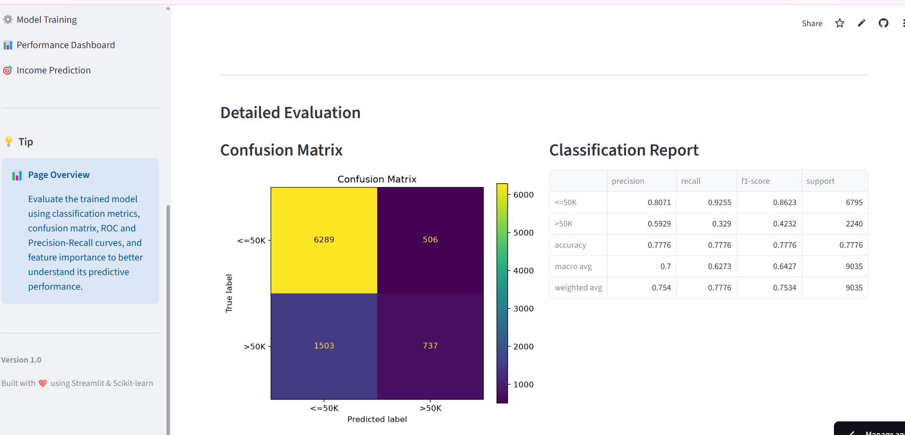

# 💼 Adult Income Prediction

🚀 **Live Demo:** https://your-streamlit-app.streamlit.app

This project is a Streamlit web application that predicts whether an individual's annual income is **greater than 50K** or **less than or equal to 50K** using supervised machine learning. Users can explore the dataset, train different classification models, compare their performance, and make predictions through an interactive interface.

---

# 📖 Project Overview

The goal of this project is to build an end-to-end machine learning application for the Adult Income dataset. The application combines data preprocessing, model training, performance evaluation, and prediction into a single web interface.

The project focuses on comparing different classification algorithms while applying preprocessing techniques, class imbalance handling, and hyperparameter tuning to improve model performance.

---

# ✨ Features

- Upload and explore the Adult Income dataset
- View dataset information and summary statistics
- Train machine learning models directly within the application
- Compare Unbalanced and SMOTE training methods
- Hyperparameter tuning using RandomizedSearchCV
- Evaluate models using multiple performance metrics
- Visualize model performance with charts and evaluation curves
- Display feature importance for tree-based models
- Predict income category using an interactive form

---

# 📊 Dataset Description

The application uses the **Adult Income** dataset from the UCI Machine Learning Repository.

The objective is to predict whether an individual's annual income is:

- **> 50K**
- **<= 50K**

The dataset contains demographic and employment-related information, including:

- Age
- Workclass
- Education
- Marital Status
- Occupation
- Relationship
- Race
- Sex
- Capital Gain
- Capital Loss
- Hours per Week
- Native Country

**Target Variable**

- Income

---

# 🤖 Model Description

Five supervised machine learning algorithms were implemented and compared:

- Naive Bayes
- Decision Tree
- Random Forest
- Support Vector Machine (SVM)
- XGBoost

The training workflow includes:

1. Data preprocessing
2. Missing value handling
3. Feature encoding
4. Train-test split
5. Class imbalance handling using SMOTE
6. Hyperparameter tuning with RandomizedSearchCV
7. Model evaluation
8. Income prediction

---

# 📈 Results

| Model | Training Method | Accuracy | F1-Score |
|--------|-----------------|---------:|---------:|
| Naive Bayes | Baseline | 0.730 | 0.619 |
| Decision Tree | Baseline | 0.847 | 0.651 |
| Random Forest | Baseline | 0.859 | 0.681 |
| SVM | SMOTE | 0.815 | 0.697 |
| XGBoost | Baseline | **0.873** | **0.718** |

**Best Performing Model:** XGBoost

---

# 🛠️ Technologies Used

- Python
- Streamlit
- Pandas
- NumPy
- Scikit-learn
- Imbalanced-learn
- XGBoost
- Matplotlib

---

# 📂 Project Structure

```text
Adult_Income_MLProject/
│── app.py
│── pages/
│   ├── Data Overview
│   ├── Model Training
│   ├── Performance Dashboard
│   └── Income Prediction
│── utils/
│── data/
│── requirements.txt
│── README.md
```

---

# ▶️ Installation Guide

Clone the repository and install the required libraries:

```bash
pip install -r requirements.txt
```

Run the application:

```bash
streamlit run app.py
```

---

# 📄 Application Pages

### 🏠 Home
Introduces the project and provides an overview of the application.

### 📊 Data Overview
Explore the dataset, review feature information, and examine the target distribution.

### ⚙️ Model Training
Select a machine learning algorithm, configure training settings, and compare Unbalanced and SMOTE approaches.

### 📈 Performance Dashboard
Evaluate trained models using performance metrics, confusion matrix, ROC curve, Precision–Recall curve, and feature importance.

### 🎯 Income Prediction
Enter feature values and predict whether annual income is greater than 50K or less than or equal to 50K.

---
# 📷 Application Screenshots

## 🏠 Home Page

The landing page introduces the project, available algorithms, and application workflow.



---

## 📊 Data Overview

Explore the uploaded dataset, review summary statistics, inspect feature types, and analyze the target class distribution.



---

## ⚙️ Model Training

Select a machine learning algorithm, configure training options, compare Unbalanced and SMOTE approaches, and train the model.



---

## 📈 Performance Dashboard

Evaluate the trained model using performance metrics, confusion matrix, ROC curve, Precision–Recall curve, and feature importance.


---

## 🎯 Income Prediction

Enter feature values to predict whether an individual's annual income is greater than 50K or less than or equal to 50K.



---

## 📋 Prediction Results

View the predicted income class together with the prediction probabilities.



---

## 📊 Model Evaluation Charts

Additional visualizations including ROC Curve, Precision–Recall Curve, and Confusion Matrix.




# 👤 Author

**Dima M. AlShurafa**

Machine Learning & Data Analytics
